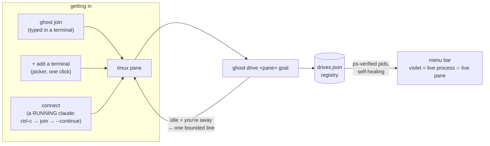

<p align="center">
  
</p>

<p align="center">
  <strong>Keep your coding agents working while you're away —<br>
  and let them write the next prompt in your voice.</strong>
</p>

<p align="center">
  
  
  
  
  
  
</p>

---

You plug the laptop in, say **"work on the gallery"** on your way out the door, and go
to bed. Ghost Type keeps a coding agent (Claude Code or Codex) moving on that project all
night: every time the agent stops, Ghost Type writes the **next** prompt — phrased the way
*you* would type it, learned from your own session history — and only stops a task when its
test actually passes. In the morning you get branches to review, not an empty terminal.

<p align="center">
  <!-- capture note: regenerate against the current dropdown (driving row + add-a-terminal
       row visible) — the committed shot must always match the shipped UI -->
  
</p>

It also ships as a native macOS **menu-bar app** for daytime: pick a terminal, give it a
goal, and a real drive loop runs it. A row reads **"driving"** only while a verified-live
process backs it, true across app restarts. A claude that's already running? **connect** —
Ghost Type Ctrl-Cs it, wraps the tab, and relaunches it with `--continue`. Three seconds,
history intact.

## Install

> Requires Node ≥ 26 and the `claude` CLI (or `codex`). Zero npm dependencies — nothing to
> install, ever. The menu-bar app assumes the repo lives at `~/dev/ghost-type`.

```bash
git clone https://github.com/hangryclaude/ghost-type ~/dev/ghost-type
cd ~/dev/ghost-type
node --test                                  # the whole suite, offline — spends no tokens

# put `ghost` on your PATH
mkdir -p ~/.local/bin
printf '#!/bin/sh\nexec /usr/bin/env node "$HOME/dev/ghost-type/bin/ghost.mjs" "$@"\n' > ~/.local/bin/ghost
chmod +x ~/.local/bin/ghost

# build + launch the menu-bar app
cd app/GhostType && swift build -c release
cp .build/release/GhostType ../GhostType.app/Contents/MacOS/
open ../GhostType.app
```

For scheduled unattended nights, install the launchd agent in
[`deploy/com.ghosttype.night.plist`](deploy/com.ghosttype.night.plist) — edit the absolute
paths, `cp` into `~/Library/LaunchAgents/`, `launchctl load`. It refuses to arm on battery
or low disk, so a sleeping laptop is a no-op.

## The gap it fills

The tooling world already solved two halves of this — and **nobody connected them**:

| Tools that keep an agent running | Tools that learn from your history |
|---|---|
| Ralph loops, Anthropic's `ralph-wiggum` plugin, `unsnooze` | chat memory, "write like me" style cloners |
| …but they re-send **one canned string** | …but they only inject a digest at session **start** |

**No tool writes the next thing you'd type.** That line — idle-triggered,
transcript-learned, prompt-*author* — is what Ghost Type crosses.

## Ten seconds to driving

The pane tints purple, and the ghost types the next prompt only when the agent inside has
gone idle *and* you haven't touched the keyboard for a minute — it backs off the moment
you're back. The same thing without the menu bar:

```bash
ghost join                        # this terminal appears in the menu bar
ghost drive %3 "fix the flaky auth test"    # or drive it headless
ghost on "work on the gallery"    # or arm the whole overnight loop
```

## A night, in six moves

```
  you ──▶ "work on the gallery"          (one line, on your way out)
            │
            ▼
   ┌───────────────────────────────────────────────────────────┐
   │  1  CLONE    throwaway local clone      origin removed →   │
   │              of the repo                push is impossible  │
   │  2  WORK     fresh `claude -p`          scoped tools,       │
   │              in the clone               your API keys stripped │
   │  3  WATCH    done? stalled?             four states,        │
   │              rate-limited? offline?     never confused      │
   │  4  VERIFY   Ghost runs the test        the agent's "done"  │
   │              itself                     is never trusted    │
   │  5  WRITE    the next prompt,           3 strikes on one    │
   │              in your voice              bug → park it       │
   │  6  REPORT   branches to merge  +  a push notification      │
   └───────────────────────────────────────────────────────────┘
            │
            ▼
  morning ──▶ review · merge the good ones · grade the ghost's prompts
```

## Safe by construction, not by promise

Four things that could go wrong at 3am — and why they can't:

| The fear | The guarantee |
|---|---|
| It wrecks your repo | Works in an **isolated `git clone --no-hardlinks`** — even the object store is a separate copy |
| It pushes junk while you sleep | The clone's **`origin` remote is deleted** — push has nowhere to go |
| It burns your fal / ElevenLabs credits | **Non-Claude API keys are stripped** from the session env by default |
| It runs forever / a $6k bill | Native **`--max-budget-usd`** + a token cap + a hard **07:00 stop** |

Live driving has its own guarantees: injection is always **one bounded, sanitized line**,
typed only into a **verified agent pane**, only after the pane has been stable across
several polls, only while **you haven't touched the keyboard for a minute** — and every
check re-runs in the instant before Enter. One live drive per pane, ever, enforced
atomically. `SIGINT` is the only kill path, so a drive always exits through its own
cleanup.

And a release gate: before any unattended night, a **dcg canary** fires a `claude -p`
session that *tries* a blocked action — if your machine's guardrails don't stop it,
Ghost Type refuses to arm. (See [`docs/live-smoke.md`](docs/live-smoke.md).)

## The live plane

How a terminal becomes driveable, and why the "driving" label can't lie:



The registry is the load-bearing part: `ghost drives --json` verifies every pid against the
process table (argv must name both `drive` and the exact pane), prunes dead entries on
read, and survives `SIGKILL`ed drives and app relaunches. The UI never shows its own
wishes — only that registry.

## How it works

Small, single-responsibility Node ESM modules — no framework, no dependencies, shells to
`git` and `claude` and parses their output by hand.

| Module | Job |
|---|---|
| `clone.mjs` | Isolated local clone, `origin` removed, path validated |
| `engine.mjs` | Spawn `claude -p`, parse the stream-json, extract usage |
| `watcher.mjs` | Classify the stop: **done · stalled · rate-limited · offline** |
| `verifier.mjs` | Run the acceptance test *ourselves*; catch "fixed it by deleting it" |
| `prompt-writer.mjs` | Compose the next prompt in your voice (fenced, scrubbed, shield-gated) |
| `governor.mjs` | Token / deadline / consecutive-error caps, metering every engine call |
| `spine.mjs` | The loop that ties it together |
| `voice.mjs` / `transcript.mjs` | Learn your prompting voice from your real `~/.claude` history |
| `drive.mjs` / `drives.mjs` | The live-drive loop + the ps-verified registry behind "driving" |
| `adopt.mjs` / `sessions.mjs` | Terminal.app tab picker · adoption · tmux enrollment |
| `report.mjs` | Morning report: status strip first, detail collapsed |
| `app/GhostType` | Native macOS menu-bar app (Swift/AppKit + SwiftUI) |

Every untrusted input (diffs, test output, transcripts) is **secret-scrubbed, byte-capped,
and fenced as data-not-instructions** before it reaches a prompt — because a transcript
can contain anything the agent read on the web.

## The `ghost` CLI

| Command | Does |
|---|---|
| **night mode** | |
| `ghost on "<goal>" [--project P] [--engine claude\|codex] [--dry-run]` | arm + run tonight's queue |
| `ghost off` · `ghost status` · `ghost queue` · `ghost report` | disarm · state · planned cards · morning report |
| `ghost scan` | list your projects + which can run unattended |
| `ghost learn` | distill your prompting voice from `~/.claude` transcripts |
| **live mode** | |
| `ghost sessions` | list tmux panes (agents first) |
| `ghost drive [--engine E] [--max N] <pane> "<goal>"` | drive a pane (flags before the pane id; everything after is the goal) |
| `ghost drives [--json]` | live drives — ps-verified, self-healing |
| `ghost undrive <pane>` | stop one (`SIGINT` → the drive's own cleanup) |
| `ghost join [name]` | wrap THIS terminal in tmux → it appears in the menu bar |
| `ghost tabs [--json]` | list Terminal.app tabs (the picker's backend) |
| `ghost adopt <tty>` | connect a tab: idle → join · running claude → ctrl-c → join → `--continue` |
| `ghost haunt <pane>` / `unhaunt <pane>` | tint a pane purple / release it (marks, doesn't drive) |
| **plumbing** | |
| `ghost doctor` | environment check (engines, guards, disk, quarantine backlog) |
| `ghost logs [N]` | recent structured log lines |

Tunables (token cap, hard-stop hour, poll cadence, thresholds) live in
`~/.ghosttype/config.json` — see
[`examples/config.example.json`](examples/config.example.json).

## Troubleshooting

| Symptom | Cause → fix |
|---|---|
| Picker says **no Terminal tabs found** | macOS blocked Apple Events → System Settings → Privacy & Security → **Automation** → GhostType → allow Terminal |
| A terminal isn't in **SESSIONS** | It's not in tmux — type `ghost join` in it, or use the picker |
| `already driving %N (pid P)` | By design: one live drive per pane — `ghost undrive %N` first |
| `ghost join … run it in a terminal` | It was piped/scripted — join wraps a real tty |
| **connect** left the tab at a shell prompt | The relaunch line needs your agent on PATH in that shell — run `claude --continue` yourself, the join already worked |
| GitHub Actions shows no runs | Deliberate: private-repo Actions won't start without billing, so CI is `workflow_dispatch`-only; the suite runs locally on every change |

## Honest limitations

- **Voice ceiling.** Research on voice imitation puts it around **0.5 vs a 0.76 human
  agreement rate**. Ghost Type will *steer like you* — it won't be indistinguishable from
  you. That's why every prompt it writes lands in the morning report for you to grade
  👍/👎, and the grade is on **judgment** (did it want the right thing?), not just style.
- **macOS only.** Tint, notifications, the menu bar, HID idle detection — all Mac APIs.
- **Driving needs tmux.** `send-keys` + `capture-pane` is the entire safety substrate;
  `ghost join`/`adopt` exist to make that a one-word cost instead of a lifestyle change.
- **The picker speaks Terminal.app.** iTerm2 isn't wired yet — `ghost join` still works
  anywhere, including iTerm.
- **connect restarts the agent.** `--continue` brings the conversation back (~3s blip),
  but it is a restart — an agent mid-tool-call loses that call.

## FAQ

**Does it spend tokens while idle?** No. The drive loop polls the pane for free; a model
is called only to compose a prompt, and only when the pane has been stable and you're
away. The whole test suite runs offline.

**Can it type over me?** It checks macOS HID idle time (default: 60s untouched) before
every injection, re-checks in the instant before Enter, and aborts rather than guess.

**Why tmux?** It's the only substrate where "read the screen" and "type one line" are
first-class, scriptable, and pane-scoped. Everything safety-critical builds on those two
primitives.

**What does it do to my repo overnight?** Nothing — it never touches it. All work happens
in a disposable clone whose `origin` has been deleted.

**What's a "card"?** The unit of overnight work — one story, one runnable acceptance
check:

```json
{
  "project": "sitecraft",
  "repoPath": "/Users/you/dev/sitecraft",
  "goal": "make the gallery lazy-load images",
  "acceptanceArgv": ["npm", "test"],
  "acceptanceTimeoutSec": 600,
  "branch": "ghost/2026-08-21-gallery",
  "maxIterations": 6,
  "maxBudgetUsd": 4.0,
  "situation": "kickoff"
}
```

Run one end-to-end against a scratch repo: `node bin/ghost-run-card.mjs card.json` — that's
the live smoke test.

## Status

```
the spine          clone → work → verify → commit → report
the smarter loop   claim≠fact · patch guard · diagnosis · ledger · pre-flight vote
voice builder      learns your real prompting voice (lowercase, no "!", keeps your typos)
the daemon         arm checks · planner · dossiers · caffeinate + heartbeat lifecycle
two engines        Claude Code AND Codex, each prompted the way it likes
menu-bar driving   pick a session → give it a goal → a verified-live drive runs it
connect            adopt a RUNNING claude tab — ctrl-c → join → --continue, one click
report             theme-aware HTML · morning push notification · prompt lineage
```

The full suite runs offline on every change (`node --test` — the badge above is the count).
Independently audited by Codex (gpt-5.6-sol, xhigh) and by parallel multi-agent
adversarial sweeps — every confirmed finding fixed, every fix re-reviewed. Design spec and
per-milestone plans live in [`docs/superpowers/`](docs/superpowers/); a hand-built
cinematic explainer lives in [`site/`](site/) (open `site/index.html` locally).

## About contributions

> *Please don't take this the wrong way, but I do not accept outside contributions for any
> of my projects. I simply don't have the mental bandwidth to review anything, and it's my
> name on the thing, so I'm responsible for any problems it causes; thus, the risk-reward
> is highly asymmetric from my perspective. I'd also have to worry about other
> "stakeholders," which seems unwise for tools I mostly make for myself for free. Feel free
> to submit issues, and even PRs if you want to illustrate a proposed fix, but know I won't
> merge them directly. Instead, I'll have Claude or Codex review submissions via `gh` and
> independently decide whether and how to address them. Bug reports in particular are
> welcome. Sorry if this offends, but I want to avoid wasted time and hurt feelings. I
> understand this isn't in sync with the prevailing open-source ethos that seeks community
> contributions, but it's the only way I can move at this velocity and keep my sanity.*

## License

MIT © Angus
