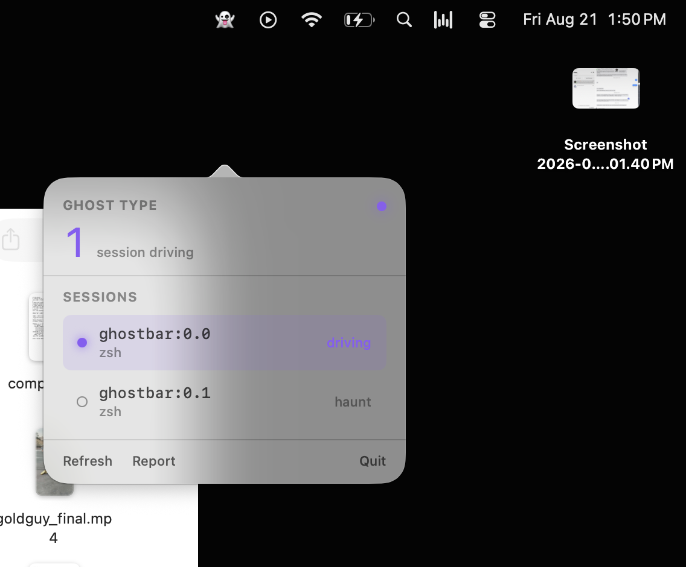

<h1 align="center">👻 Ghost Type</h1>

<p align="center">
  <strong>Keep your coding agents working while you're away —<br>
  and let them write the next prompt in your voice.</strong>
</p>

<p align="center">
  
  
  
  
  
</p>

---

You plug the laptop in, say **"work on the gallery"** on your way out the door, and go
to bed. Ghost Type keeps a coding agent (Claude Code or Codex) moving on that project all
night: every time the agent stops, Ghost Type writes the **next** prompt — phrased the way
*you* would type it, learned from your own session history — and only stops a task when its
test actually passes. In the morning you get branches to review, not an empty terminal.

<p align="center">
  
</p>

It ships as a native macOS **menu-bar app**: pick which terminal session it drives, and
that pane turns purple while it works. Or drive everything headless from the `ghost` CLI.

## The gap it fills

The tooling world already solved two halves of this — and **nobody connected them**:

| Tools that keep an agent running | Tools that learn from your history |
|---|---|
| Ralph loops, Anthropic's `ralph-wiggum` plugin, `unsnooze` | chat memory, "write like me" style cloners |
| …but they re-send **one canned string** | …but they only inject a digest at session **start** |

Every keep-alive tool tops out at *"send `continue` again."* Every voice tool clones what
the agent writes *back to you*. **No tool writes the next thing you'd type.** That line —
idle-triggered, transcript-learned, prompt-*author* — is what Ghost Type crosses.

## A night, in six moves

```
  you ──▶ "work on the gallery"          (one line, on your way out)
            │
            ▼
   ┌───────────────────────────────────────────────────────────┐
   │  1  CLONE    throwaway local clone      origin removed →   │
   │              of the repo                push is impossible  │
   │  2  WORK     fresh `claude -p`          scoped tools,       │
   │              in the clone               your API keys stripped │
   │  3  WATCH    done? stalled?             four states,        │
   │              rate-limited? offline?     never confused      │
   │  4  VERIFY   Ghost runs the test        the agent's "done"  │
   │              itself                     is never trusted    │
   │  5  WRITE    the next prompt,           3 strikes on one    │
   │              in your voice              bug → park it       │
   │  6  REPORT   branches to merge  +  a push notification      │
   └───────────────────────────────────────────────────────────┘
            │
            ▼
  morning ──▶ review · merge the good ones · grade the ghost's prompts
```

## Safe by construction, not by promise

Four things that could go wrong at 3am — and why they can't:

| The fear | The guarantee |
|---|---|
| 🔥 It wrecks your repo | Works in an **isolated `git clone --no-hardlinks`** — even the object store is a separate copy |
| 🚀 It pushes junk while you sleep | The clone's **`origin` remote is deleted** — push has nowhere to go |
| 💸 It burns your fal / ElevenLabs credits | **Non-Claude API keys are stripped** from the session env by default |
| ♾️ It runs forever / a $6k bill | Native **`--max-budget-usd`** + a token cap + a hard **07:00 stop** |

And a release gate: before any unattended night, a **dcg canary** fires a `claude -p`
session that *tries* a blocked action — if your machine's guardrails don't stop it,
Ghost Type refuses to arm. (See [`docs/live-smoke.md`](docs/live-smoke.md).)

## The site

A hand-built explainer with cinematic clips (generated via Higgsfield) lives in
[`site/`](site/) — open `site/index.html` locally to see how it works, end to end.

## Quick start

> Requires Node ≥ 26 and the `claude` CLI. Zero npm dependencies.

```bash
git clone https://github.com/hangryclaude/ghost-type
cd ghost-type
node --test          # 271 tests, all offline — spends no tokens
```

Run one real card end-to-end against a scratch repo (this is the live smoke test):

```bash
node bin/ghost-run-card.mjs path/to/card.json
```

A **card** is the unit of overnight work — one story, one runnable acceptance check:

```json
{
  "project": "sitecraft",
  "repoPath": "/Users/you/dev/sitecraft",
  "goal": "make the gallery lazy-load images",
  "acceptanceArgv": ["npm", "test"],
  "acceptanceTimeoutSec": 600,
  "branch": "ghost/2026-08-21-gallery",
  "maxIterations": 6,
  "maxBudgetUsd": 4.0,
  "situation": "kickoff"
}
```

## How it works

Small, single-responsibility Node ESM modules — no framework, no dependencies, shells to
`git` and `claude` and parses their output by hand.

| Module | Job |
|---|---|
| `clone.mjs` | Isolated local clone, `origin` removed, path validated |
| `engine.mjs` | Spawn `claude -p`, parse the stream-json, extract usage |
| `watcher.mjs` | Classify the stop: **done · stalled · rate-limited · offline** |
| `verifier.mjs` | Run the acceptance test *ourselves*; catch "fixed it by deleting it" |
| `prompt-writer.mjs` | Compose the next prompt in your voice (fenced, scrubbed, shield-gated) |
| `governor.mjs` | Token / deadline / consecutive-error caps, metering every engine call |
| `spine.mjs` | The loop that ties it together |
| `voice.mjs` / `transcript.mjs` | Learn your prompting voice from your real `~/.claude` history |
| `drive.mjs` / `haunt.mjs` / `sessions.mjs` | Haunt mode: pick a live pane, tint it, inject the next prompt |
| `report.mjs` | Morning report: status strip first, detail collapsed |
| `app/GhostType` | Native macOS menu-bar app (Swift/AppKit + SwiftUI) |

Every untrusted input (diffs, test output, transcripts) is **secret-scrubbed, byte-capped,
and fenced as data-not-instructions** before it reaches a prompt — because a transcript
can contain anything the agent read on the web.

## One honest limitation

Research on voice imitation puts the ceiling around **0.5 vs a 0.76 human agreement rate**.
So Ghost Type will *steer like you* — it won't be indistinguishable from you. That's why
every prompt it writes lands in the morning report for you to grade 👍/👎, and the grade is
on **judgment** (did it want the right thing?), not just style.

## The `ghost` CLI

```bash
ghost doctor                    # check the environment is ready to run
ghost scan                      # list your projects + which can run unattended
ghost learn                     # distill your prompting voice from ~/.claude transcripts
ghost on "<goal>" [--project P] [--engine claude|codex] [--dry-run]   # arm + run tonight
ghost off | status | queue | report

# haunt mode — drive a live terminal session
ghost sessions                  # list your tmux panes (agents first)
ghost haunt <pane> / unhaunt <pane>     # tint a pane purple / release it
ghost drive <pane> "<goal>"     # watch it; type the next prompt when it goes idle
```

Tunables (token cap, hard-stop hour, thresholds) live in `~/.ghosttype/config.json` —
see [`examples/config.example.json`](examples/config.example.json). The native menu-bar app
(`app/GhostType`) wraps all of this: `cd app/GhostType && swift build -c release`.

To run it on a schedule (nightly, unattended), install the launchd agent in
[`deploy/com.ghosttype.night.plist`](deploy/com.ghosttype.night.plist) — edit the absolute
paths, `cp` it into `~/Library/LaunchAgents/`, and `launchctl load` it. It refuses to arm on
battery or low disk, so a sleeping laptop is a no-op.

## Status

```
✅  the spine        clone → work → verify → commit → report
✅  the smarter loop  claim≠fact · patch guard · diagnosis · ledger · pre-flight vote
✅  voice builder     learns your real prompting voice (lowercase, no "!", keeps your typos)
✅  the daemon        arm checks · planner · dossiers · caffeinate + heartbeat lifecycle
✅  two engines       Claude Code AND Codex, each prompted the way it likes
✅  haunt mode        select a terminal from the menu bar → it turns purple → it drives it
✅  report            theme-aware HTML · morning push notification · prompt lineage

271 tests, all offline (`node --test`) · independently audited by Codex (gpt-5.6-sol, xhigh) across twenty-three rounds — every finding fixed
```

Ghost Type never trusts a "done" claim — it re-runs the test itself and flags a
**false-done** — and fails fast on an empty patch. Every unattended run is fenced by hard
guardrails: isolated `--no-hardlinks` clones with no `origin`, non-Claude keys stripped, a
budget + token + 07:00 cap, and injection that only ever sends one bounded line and never
types while you're at the keyboard. Design spec and per-milestone plans live in
[`docs/superpowers/`](docs/superpowers/).

## License

MIT © Angus
